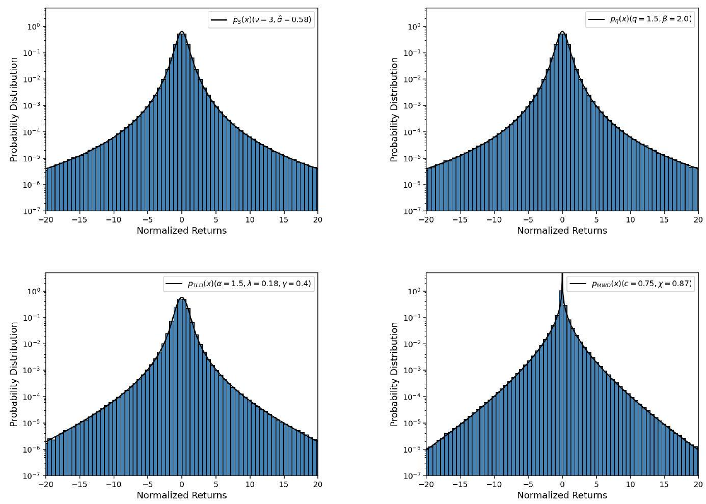

^{\mathrm{a}, \mathrm{b}}$, Giacomo Livan $^{\mathrm{c}}$, Guido Montagna ${ }^{\mathrm{a}, \mathrm{b}, *}$, Oreste Nicrosini ${ }^{\mathrm{b}}$ \\ ${ }^{a}$ Dipartimento di Fisica, Università degli Studi di Pavia, Via A. Bassi 6, 27100, Pavia, Italy \\ ${ }^{b}$ Istituto Nazionale di Fisica Nucleare, Sezione di Pavia, Via A. Bassi 6, 27100, Pavia, Italy \\ ${ }^{c}$ Department of Computer Science, University College London, 66-72 Gower Street, London WC1E 6EA, United Kingdom
}

Keywords: Econophysics, Financial Returns, Heavy-Tailed Distributions, Stochastic Processes, Monte Carlo Simulations, Option Pricing

\section{Introduction}

Since the seminal papers of Mandelbrot [1] and Fama [2] on the statistical properties of commodity and stock market prices, many studies in finance and econophysics over the last few decades clearly showed that the empirical distribution of financial log-returns deviates from the Gaussian shape inherent to the Brownian motion dynamics introduced by Osborne [3] and Samuelson [4], following Bachelier [5. The deviation of the empirical distributions from the bell-shaped curve is particularly pronounced in the high-frequency limit of

markets, speculative prices and epochs [6]10].

The empirical return distribution typically exhibits a sharp central body and a fat-tailed behavior for large price movements. Therefore, it is an example of leptokurtic distribution, which means that extreme events occur more often than predicted by the Gaussian statistics. There is a large consensus that the empirical returns in the tails behave as a power law $p(x) \propto 1 /|x|^{1+\alpha}$, with a tail exponent $\alpha$ close to three in the high-frequency limit [11 16. This implies that the variance of returns is finite. Power-law behavior has

* Corresponding author

Email address: guido.montagna@unipv.it (Guido Montagna)

${ }^{1}$ In the paper, we use returns and log-returns as synonyms when referring to financial data and associated modeling, since it is known that they behave as equivalent empirical random variables in the high-frequency regime [6, 7]. Distinction is made in the simulation of their stochastic dynamics and study of the limit theorems, as detailed in the following. been recently detected in the scaling properties of extreme price movements in Bitcoin markets as well [17, albeit with a power-law exponent suggesting that cryptocurrency returns exhibit heavier tails than stocks.

To capture the above properties, different distributions borrowed from probability and statistics, as well as from statistical physics, have been proposed in the literature. The most important examples of non-Gaussian models that provide a good fit to the data are the truncated Lévy distribution [7, 18 21 2 the Student's $t$-distribution [7, 27 33], the q-Gaussian (Tsallis) distribution [15, 34 36], the hyperbolic distribution [37, 38. and the modified Weibull or stretched exponential distribution 39 42. A comparison of distributions in fitting the tails of daily index fluctuations of several stock markets can be found in 43 .

The results of the empirical analyses are also compatible with the scenario where price returns on liquid markets are, beyond a correlation time of a few tens of minutes, uncorrelated random variables [6 8] and where the log-return distribution converges very slowly to a Gaussian by aggregation [6, 7, 13, 14. However, it is also known that returns exhibit non-linear correlations between their absolute value or square 6 ] and, therefore, they can not be treated as independent variables. The latter feature has to be ascribed to the return volatility.

A direct consequence of the empirical behavior of stock prices is that all those quantities and strategies that are intimately related to the return dynamics are strongly affected by the anomalous properties of their statistics. Typical examples are given by the fair price of stock options, portfolio management and evaluation of market risk measures. In all these contexts, the price changes play the role of fluctuations associated to underlying risky assets.

According to the standard and still widespread approach used in quantitative finance, the stochastic motion of stock prices is modeled using a Geometric Brownian Motion (GBM) 3, 4, 44, 45, which implies that log-returns are normally distributed. The rationale behind this assumption is that the simplicity of the Gaussian modeling and, more importantly, the whole machinery of Itô stochastic calculus can be fully exploited to obtain analytically tractable results. The most prominent example is given by the celebrated Black and Scholes model of option pricing [46] (see also [47]).

In recent times, the overwhelming evidence about the leptokurtic nature of stock returns stimulated new directions in scholarly research and financial practice. For example, in the financial industry today, the risk measures, such as Value-at-Risk and Expected Shortfall, are estimated by using historical data and computing them from the percentiles of the distribution of real data, instead of using a parametric approach based on the normal approximation. In finance and econophysics, non-Gaussian closed-form expressions for the risk measures 48 50 , have been obtained by analytically modeling the fat-tailed nature of price changes. Concerning option pricing, in the model proposed by Heston in finance [51, the return volatility follows a random process and provides a more accurate option pricing than in the Black and Scholes model. In finance and econophysics, many papers addressed the problem of non-Gaussian option pricing [52 58] using, in particular, Lévy, Student's $t$ or Tsallis distributions to model the stock price dynamics.

Given the above motivations, the aim of this paper is to perform a systematic comparison of the main non-Gaussian models of the financial market dynamics. To characterize the probability of extreme price fluctuations, the deviations from the Gaussian behavior are parametrized in terms of tail exponents as obtained in the empirical studies of high-frequency returns. By using different Monte Carlo (MC) algorithms, we generate large samples of random deviates as synthetic data representations of financial fluctuations, in order to compare their statistical properties and simulate their dynamical evolution. To the best of our knowledge, a comparative study of this kind represents an original addition to the literature and may contribute to elucidate the similarities and universal properties of the existing models. It also opens the way to a number of possible applications. As a first example, we apply our modeling to option pricing and study the differences with the results of the standard Gaussian approach à la Black and Scholes.

The paper is organized as follows. In Section 2 we review the theoretical models and introduce the probability distributions considered in our study. In Section 3 we present and discuss the results of our simulations, focusing on the behavior of the models in the tails, the dynamics of non-Gaussian asset prices

${ }^{2}$ Empirical studies of daily and intraday returns using pure Lévy distributions can be found in the classical econophysics papers 22,23 and, more recently, in $24,26$. and the convergence rate to the asymptotic distributions. In Section 4 we investigate the implications of our modeling for option pricing. The main conclusions and perspectives of the work are drawn in Section 5

\section{Theoretical Modeling of Return Distributions}

The asset price models used in our study are those that received the most attention in finance and econophysics in recent years. In agreement with the empirical findings, all of them are specified by probability density functions (PDFs) with zero mean (as we are interested to model price changes with subtracted average returns), finite variance and a positive excess kurtosis as a measure of outliers. For each PDF, the shape parameters are chosen to fit at best empirical data in the tails, as detailed below. Also note that we consider symmetric PDF as it is known that empirically skewness effects in the high-frequency return distributions are quite small, much smaller than the large kurtosis contribution [7, 43, 59, 60.

We list in the following the main formulae defining the distributions that are considered in our study. In the equations below, the real-valued variable $x$ can be equally understood as return or log-return.

a) Student's $t$-distribution

It has been widely used to successfully model returns both in finance and econophysics. The (generalized or scaled) Student's t, with zero location parameter, has PDF given by

$$
p_{S}(x)=\frac{\Gamma\left(\frac{\nu+1}{2}\right)}{\Gamma\left(\frac{\nu}{2}\right) \sqrt{\pi \nu} \hat{\sigma}}\left[1+\frac{1}{\nu}\left(\frac{x}{\hat{\sigma}}\right)^{2}\right]^{-(\nu+1) / 2},
$$

where $\hat{\sigma}$ is a scale parameter and $\nu$ is the number of degrees of freedom that plays the role of shape parameter. In Eq. (1), the symbol $\Gamma$ denotes the Gamma function. For $\nu>2$, the variance is $\hat{\sigma}^{2} \nu /(\nu-2)$; the excess kurtosis is $6 /(\nu-4)$ for $\nu>4$ and infinite for $2<\nu \leq 4$. In the asymptotic limit $|x| \rightarrow \infty$, the Student's $t$ behaves as a power law of the form

$$
p_{S}(x) \underset{|x| \rightarrow \infty}{\longrightarrow}|x|^{-(\nu+1)} .
$$

The typical values for $\nu$ found in the empirical studies are $\nu \simeq 3$ for intraday returns $[7,31,32$, and $\nu \simeq 4$ for daily returns [7, 27, 30,33 .

b) $q$-Gaussian distribution

This distribution arises from Tsallis non-extensive statistical mechanics and has been applied in many different disciplinary contexts, including modeling of financial data. Its standard PDF is given by

$$
p_{q}(x)=\frac{\sqrt{\beta}}{C_{q}} e_{q}\left(-\beta x^{2}\right),
$$

where $\beta$ is a scale parameter, $C_{q}$ is a normalization factor and $e_{q}(\bullet)$ is the $q$-exponential function given by $(q \neq 1)$

$$
e_{q}(x)=[1+(1-q) x]^{1 /(1-q)} .
$$

For $1<q<3$, which is the range of our concern, the normalization constant reads as follows

$$
C_{q}=\sqrt{\frac{\pi}{q-1}} \frac{\Gamma\left(\frac{3-q}{2(q-1)}\right)}{\Gamma\left(\frac{1}{q-1}\right)} .
$$

For $q<5 / 3$ the variance is $\beta^{-1} /(5-3 q)$; the excess kurtosis exists for $q<7 / 5$ and is given by $6(q-1) /(7-5 q)$. The shape of the PDF is determined by the $q$ parameter $(q \rightarrow 1$ yielding the normal distribution) and for $q>1$ the $q$-Gaussian has asymptotic heavy tails given by the power law

$$
p_{q}(x) \underset{|x| \rightarrow \infty}{\longrightarrow}|x|^{-2 /(q-1)} \text {. }
$$

Note that there is a direct mapping between the Student's $t$ and $q$-Gaussian distribution. Actually, given a $q$-Gaussian with parameter $q$, the equivalent Student's $t$, as given by Eq. 11), is obtained by applying the following replacements in Eq. $(3)$

$$
q=\frac{\nu+3}{\nu+1} \quad \text { with } \quad \beta=\frac{1}{(3-q) \hat{\sigma}^{2}} .
$$

According to the available econophysics studies for intraday and daily returns, the tail parameter $q$ preferably lies in the range $q \simeq 1.4 \div 1.5[15,34,35$.

c) Truncated Lévy distribution

For this popular model of asset price fluctuations, there is no analytical expression for the PDF but its characteristic function is known in closed form. Following the literature [7, 19, 21, we consider a symmetric Truncated Lévy Distribution (TLD) for which a power law is only valid in an intermediate range and decays exponentially beyond it. To account for this smooth exponential cut-off for large arguments, we adopt the expression for the characteristic function first proposed in 61. It explicitly reads as follows

$$
\phi_{\mathrm{TLD}}(k)=\exp \left[-\gamma \frac{\left(k^{2}+\lambda^{2}\right)^{\alpha / 2} \cos [\alpha \arctan (|k| / \lambda)]-\lambda^{\alpha}}{\cos \left(\frac{\pi}{2} \alpha\right)}\right] \quad \alpha \neq 1
$$

where $\gamma$ is a scale parameter, $\lambda$ is a truncation parameter and $\alpha$ is the Lévy characteristic exponent, with $0<\alpha \leq 2$, but $\alpha \neq 1$. For $\lambda \rightarrow 0$, Eq. (8) reduces to the well-known expression of the characteristic function of a (symmetric) $\alpha$-stable distribution [6, [], where $\alpha=1$ and $\alpha=2$ correspond to the Cauchy and Gaussian distribution, respectively. Note that the TLD, in contrast to the two-parameter distributions discussed above and in the following, is defined in terms of three free parameters and that its shape is determined by the parameters $\alpha$ and $\lambda$.

The associated PDF is obtained from the characteristic function through an inverse Fourier transform

$$
p_{\mathrm{TLD}}(x)=\frac{1}{2 \pi} \int d k e^{-i k x} \phi_{\mathrm{TLD}}(k),
$$

which is automatically normalized since $\phi_{\mathrm{TLD}}(k=0)=1$. The truncated Lévy flight that one obtains by inserting Eq. (8) into Eq. (9) behaves as a power law smoothed by an exponential of the form $|x|^{-(1+\alpha)} e^{-\lambda|x|}[61]$

The first cumulants of the TLD can be computed as successive derivatives of the logarithm of its characteristic function and their expression can be found in [7] for any $\alpha$ in the range $1<\alpha \leq 2$. The typical value present in fitting data with a TLD [7, 19, or close to the characteristic exponent found in fits of return time series using a pure Lévy distribution 2326 is $\alpha=3 / 2$. In this case, the variance and excess kurtosis are given by

$$
\sigma_{\mathrm{TLD}}^{2}=\frac{3}{2 \sqrt{2}} \frac{\gamma}{\sqrt{\lambda}} \quad k_{\mathrm{TLD}}=\frac{\sqrt{2}}{2} \frac{1}{\gamma \lambda^{3 / 2}} \quad \text { for } \quad \alpha=\frac{3}{2} .
$$

d) Modified Weibull distribution

This model has been proposed in econophysics in 39 41 (see references in 42 for its use in finance), in particular to describe the behavior of empirical log-returns for large variations in the tails.

The PDF of the Modified Weibull Distribution (MWD) is given by

$$
p_{\operatorname{MWD}}(x)=\frac{1}{2 \sqrt{\pi}} \frac{c}{\chi}\left(\frac{|x|}{\chi}\right)^{c / 2-1} e^{-(|x| / \chi)^{c}}
$$

where $\chi$ and $c$ are a scale and shape parameter, respectively. It can be seen as a particular case of a generalized Gamma distribution but with domain $x \in \mathbb{R}$. It reduces to a standard Gaussian $\mathrm{PDF}$ for $c=2$ and $\chi=\sqrt{2}$. When the exponent $c$ is smaller than one, the PDF is characterized by the presence of a stretched exponential, which decays more slowly than an exponential function and is found in various systems in nature and society [39.

The variance and excess kurtosis of the MWD are given by

$$
\sigma_{\mathrm{MWD}}^{2}=\chi^{2} \frac{\Gamma\left(\frac{1}{2}+\frac{2}{c}\right)}{\sqrt{\pi}} \quad k_{\mathrm{MWD}}=\frac{\Gamma\left(\frac{1}{2}+\frac{4}{c}\right)}{\left[\Gamma\left(\frac{1}{2}+\frac{2}{c}\right)\right]^{2}} \sqrt{\pi}-3 .
$$

The best fit values for the shape parameter $c$ mostly found in the empirical studies are in the range $c \simeq$ $0.6 \div 0.9[39$, 41 .

Figure 1: Comparison between standardized (zero mean and unit variance) non-Gaussian return distributions and the Gaussian (dotted line) for normalized returns in the interval $[-20,+20]$. The choice of the distribution parameters used to model the behavior of high-frequency normalized returns is explained in the text. Note the log scale to emphasize the differences with the Gaussian shape and the similarities of the non-Gaussian distributions along the tails when using realistic and consistent shape parameters.

In Fig. 1, we show a first comparison between the aforementioned non-Gaussian distributions. For consistency, we normalize all the PDFs to have unit variance according to the following procedure. ${ }^{3}$ For the two-parameter distributions, we first fix the shape parameter by using one of the preferred values found in the empirical analyses of intraday returns: $\nu=3$ for the Student's $t, q=1.5$ for the $q$-Gaussian and $c=0.75$ for the MWD. Then, the scale parameters, i.e. $\hat{\sigma}$ (Student's $t), \beta$ ( $q$-Gaussian) and $\chi$ (MWD), are chosen such that the variance is equal to one for each distribution. For the three-parameter TLD, we first impose $\alpha=3 / 2$ and then use Eq. 10 to derive the scale parameter $\gamma$ as $\gamma=2 \sqrt{2} \sqrt{\lambda} / 3$, that ensures unit variance. The truncation parameter $\lambda$ is finally chosen such that the two-parameter $\lambda$ and $\gamma$ theoretical combination used in fitting high-frequency data agrees with the measured value [7). In so doing, we obtain $\lambda \simeq 0.18$ (and thus $\gamma \simeq 0.4$ from the relation above), as better explained in the following. Our overall strategy closely follows the procedure used in [7] to constrain the free distribution parameters when fitting empirical data. In Fig. 1. the range for the normalized returns is chosen to be $[-20,+20]$ to mimic the outliers with largely positive kurtosis observed in the markets in the high-frequency limit [6] 9, 23, 31, 34.

It is worth noting that, according to our empirically motivated choice of the free distribution parameters, the kurtosis of the Student's $t$ and $q$-Gaussian PDFs does not exist, whereas the kurtosis of the TLD and MWD distributions is large but finite. This is due to the fact that the non-Gaussian models under

${ }^{3}$ Note that the PDF standardization agrees with the strategy adopted in many of the fits to financial data, where returns are normalized by subtracting the empirical mean and dividing by the measured standard deviation. consideration belong to two different classes of distributions. Indeed, the Student's $t$ and $q$-Gaussian PDFs follow asymptotically a pure power law that implies an infinite kurtosis. On the contrary, for the TLD and MWD distributions, the power law behavior is smoothed by an exponential or stretched exponential decay that yields a finite kurtosis. This issue is further discussed in the following and in Appendix A

As can be seen in Fig. 1, the similarity between the considered non-Gaussian models is notable, with a comparable leptokurtic behavior and a quite good agreement along the tails, where extreme events model the large price movements occurring in financial markets. In particular, the common behavior of the Student's $t$ and $q$-Gaussian modeling is due to the equivalence of the two parameterizations under our choice of the tail parameters, as discussed above. More generally, the similar features of the non-Gaussian return distributions are further scrutinized and motivated in the next Section.

\section{Monte Carlo Simulations and Non-Gaussian Dynamics}

To investigate the statistical properties of the non-Gaussian return models and simulate their dynamics, it is necessary having at hands MC samples of pseudorandom numbers (shortly denoted as random numbers or random deviates in the following) drawn from the distributions under study. This topic is addressed in the present Section, along with a study of the convergence to the asymptotic distributions of the non-Gaussian stochastic processes.

\subsection{Generation of Non-Gaussian Random Deviates and Tail Behavior}

A number of MC algorithms have been used and cross-checked to generate non-Gaussian random deviates as synthetic data representations of actual financial fluctuations.

Generally speaking, for the Student's $t, q$-Gaussian and MWD models, whose PDFs are known analytically in direct $x$-space, a standard acceptance-rejection algorithm has been adopted to generate the associated random numbers. For the $q$-Gaussian, the results have been successfully cross-checked with those obtained by using the generalized Box-Muller method of 62,63 . Note that a simple variation of the latter algorithm can provide random numbers for a Student's $t$ distribution as well, hence we used it also to verify the results of the acceptance-rejection method for this distribution, finding agreement.

The random deviates associated to the TLD have been generated according to the following step-bystep procedure. We first computed the inverse Fourier transform as in Eq. (9) by using the Fast Fourier Transform algorithm and then interpolated the resulting points with a cubic spline interpolation, in order to obtain a smooth $p_{\text {TLD }}(x)$ function in the direct space and lastly apply an acceptance-rejection algorithm. To test the overall strategy, we checked that in the limit $\lambda \rightarrow 0$ (i.e. $\lambda$ vanishingly small in the simulations), where Eq. 8 reduces to the characteristic function of a pure $\alpha$-stable distribution, our method provides MC samples in agreement with those obtained with the algorithm of 64 , 65 for different values of $\alpha$ (see 66 for an independent algorithm to simulate Lévy stable processes). In particular, we checked that Cauchy and Gaussian random deviates are correctly recovered for $\alpha=1$ and $\alpha=2$, respectively.

An example of the results of the above MC experiments is shown in Fig. 2 For each model, we generated $M=10^{8}$ non-Gaussian random numbers, denoted by $\xi_{N G}$, by using the acceptance-rejection algorithm over the wide but bounded support $[-30,+30]$, in order to sample the typical probability associated to the large jumps occurring in the markets that yield a substantial kurtosis [7, 9, 30, 31, 60, 67. As can be seen from Fig.2 the normalized histograms corresponding to the generated MC events nicely agree with the analytical expression of the PDF for each non-Gaussian model.

It is worth noting that, for the Student's $t$ and $q$-Gaussian distributions with ill-defined kurtosis, the generation of non-Gaussian random variables over a large but bounded domain introduces an effective cutoff in their asymptotic power-law behavior. This makes the kurtosis of the associated random samples comparable to the empirical one and stable as a function of $M$, as shown in Appendix A. Actually, in the financial markets, the returns do not vary in their whole unlimited range and the measured kurtosis is typically large but obviously limited, even in the presence of empirical power-law tails [67. Hence, our procedure resembles the sharp truncation of a pure $\alpha$-stable distribution to get a truncated Lévy flight with finite variance and higher moments 68, that can be used as a model of the price change statistics $6,69,72]$. 

Figure 2: Log scale comparison between the normalized non-Gaussian random number distributions (blue histograms) and the analytical expressions of the associated standardized PDF (solid line) over the interval [-20,+20]. Upper panel: Student's $t$ $(\nu=3)$ and $q$-Gaussian $(q=1.5)$ distributions. Lower panel: $\mathrm{TLD}(\alpha=3 / 2, \lambda=0.18)$ and MWD $(c=0.75)$ models.

This approach is further supported by the good fit to extreme price movements provided by a truncated Pareto model 73 and by the decline of the kurtosis towards normality with time aggregation 74 .

Note also that the generation of $\xi_{N G}$ over a finite range introduces a (small) bias in the characterization of their unit variance. For this reason, we normalize all the generated random deviates through the replacement $\xi_{N G} \rightarrow \xi_{N G} / s$, where $s$ is the sample standard deviation of each non-Gaussian MC sample 4 . According to this overall strategy, all our random numbers can be seen as synthetic representations of normalized financial returns, as further discussed in the following.

We used the above $M=10^{8}$ random deviates to investigate the behavior of the non-Gaussian return models in the tails. To this end, we studied the complementary cumulative distribution function (CCDF) which, for a given $\mathrm{PDF} p(x)$, is defined as

$$
P(x)=\int_{x}^{+\infty} p\left(x^{\prime}\right) d x^{\prime} .
$$

As it is well known, it gives the probability that the real-valued random variable under consideration will take a value greater than or equal to the threshold $x$.

For each non-Gaussian model, we computed the probability of Eq. 13 from the generated random number samples. The results of this comparative analysis are shown in Fig. 3 for normalized returns above threshold in the range $[0.01,20]$. As can be noted, the CCDFs associated to the different distributions not

${ }^{4}$ We do not subtract the sample mean in the normalization procedure as its value is negligible, at the level of $10^{-4} \div 10^{-5}$, for all the models. surprisingly display some difference but there is also a noticeable overall consistency for what concerns the dynamics of extreme price changes along the tails.

Figure 3: Log-log scale comparison between the CCDFs of standardized non-Gaussian return distributions and the Gaussian CCDF (dotted line) for normalized returns above threshold in the range [0.01,20]. The distribution parameters modeling the high-frequency dynamics are the same as those in Fig. $1 . M=10^{8}$ non-Gaussian random deviates are generated over the interval $[-30,+30]$ and used to compute each CCDF.

This substantial agreement is not accidental and can be explained as follows. For the Student's $t$ and $q$ Gaussian distributions, the choice of the shape parameters $\nu=3$ and $q=1.5$ implies that both PDFs follow asymptotically the power law $p(x) \propto x^{-4}$ (for positive $x$ ) and therefore the asymptotic behavior of both CCDFs is given by $P(x) \propto x^{-3}$. This trend is known as inverse cubic law 11 16], which is considered to be a robust stylized fact as it is generally observed in the high-frequency regime for different stock markets and asset prices. On the other hand, the Student's $t$ and TLD provide similarly good fits to financial fluctuations in the tails, as shown in 7]. For example, in a fit to the 30 minute data of the S\&P 500 index, $\nu \simeq 3$ for the Student's $t$ distribution is found to correspond for the $\alpha=3 / 2$ TLD to the fitted quantity $\gamma^{2 / 3} \lambda=0.096[7$. For our TLD parameter choice, i.e. $\lambda=0.18$ and thus $\gamma=0.4$ (from the unit variance constraint), we get the theoretical value $\gamma^{2 / 3} \lambda \simeq 0.098$, in good agreement with the measured parameter combination. As remarked in 7], the above quantity represents the ratio of the typical scale of the core of the TLD given by $\gamma^{2 / 3}$ to the scale $\lambda^{-1}$ at which the exponential cut-off takes place. Concerning the MWD model, it is known that the associated CCDF for the shape parameter $c$ in the range $c \simeq 0.6 \div 0.9(c=0.75$ in our case) accurately describes extreme price movements of traded currency exchange rates and that, in general, one cannot clearly distinguish between a power law tail and a stretched exponential decay 40 . As shown in 40], this is due to the fact that the stretched exponential tends to the Pareto distribution in a certain limit where the shape parameter $c$ goes to zero.

To assess the reliability of our non-Gaussian modeling along the tails, we compared the kurtosis as computed from the generated MC samples with the theoretical results, whenever possible, as well as with the typically measured values. This cross-check is described in Appendix A.

It is worth noting that a similar picture holds for a modeling of the thinner tails of daily returns with less pronounced kurtosis, when making an appropriate choice of the free distribution parameters. Actually, we observed that the considered non-Gaussian models provide a similar description of price variations when using the following set of parameters in the standardized distributions: $\nu=4$ for the Student's $t, q=1.4$ for the $q$-Gaussian, $\lambda=0.26$ for the $\alpha=3 / 2$ TLD and $c=0.85$ for the MWD.

To summarize, the similarities between the non-Gaussian return models as observed in Fig. 1 and Fig. 3 are a direct and natural consequence of a coherent and realistic choice of the distribution parameters, as well as of a large body of empirical evidences about the universal scaling properties of large price movements.

\subsection{Simulations of Non-Gaussian Return Dynamics}

The random numbers drawn from the distributions under consideration can be also used to simulate the dynamics of returns and log-returns under non-Gaussian models, as shown in the following.

According to the standard model of finance, the time evolution of asset prices is described by a GBM given by the following stochastic differential equation (SDE)

$$
\mathrm{d} S(t)=\mu S(t) \mathrm{d} t+\sigma S(t) \mathrm{d} W(t)
$$

where $\mu$ is the percentage drift, $\sigma$ the volatility and $d W(t)$ the increment of a Wiener process (Itô prescription is assumed). Equation 14 models the stochastic motion of returns, i.e. percentage price variations. By Itô lemma, it follows that the dynamics of log-returns is given by the SDE of a Brownian motion with drift, i.e.

$$
\mathrm{d} \ln S(t)=\left(\mu-\frac{\sigma^{2}}{2}\right) \mathrm{d} t+\sigma \mathrm{d} W(t)
$$

By integrating the above equations with the use of Itô calculus 44, 45, it turns out that log-returns follow a normal distribution (with a variance growing linearly as a function of time, because of the properties of the Wiener process) and asset prices are log-normally distributed random variables.

Both Eq. 14 and Eq. 15 can be simulated through a random walk MC algorithm in discrete time by using the Euler-Maruyama method 44 given the following recursive equations

$$
\begin{aligned}
& S(t+\Delta t)=S(t)+\mu S(t) \Delta t+\sigma S(t) \xi_{G} \sqrt{\Delta t} \\
& \ln S(t+\Delta t)=\ln S(t)+\left(\mu-\frac{\sigma^{2}}{2}\right) \Delta t+\sigma \xi_{G} \sqrt{\Delta t}
\end{aligned}
$$

In Eq. 16 and Eq. $17, \xi_{G}$ is a random number drawn from a standard normal distribution, i.e. $\xi_{G} \sim$ $\mathcal{N}(0,1)$, and the discrete time increment $\Delta t$ has to be chosen sufficiently small, so that the numerical simulation provides a description as accurate as possible of the continuous-time processes given by Eq. 14 . and Eq. 15 .

Figure 4: Left panel: Non-Gaussian random walk simulations of asset price dynamics in comparison with the Gaussian modeling (black dotted line). The parameters of the standardized non-Gaussian distributions are the same as those of the previous Sections. Other quantities are: $\Delta t=10^{-3}, N=10^{3}$ (number of iterations), so that $t=N \Delta t$ up to $T=1, S(0)=150$, $\mu=0.01$ and $\sigma=0.1$. Right panel: log-returns for the TLD (green fluctuations) and Gaussian (black fluctuations) dynamics. Similar results hold for the other non-Gaussian models.

Eq. (16) and Eq. (17) can be generalized to non-Gaussian scenarios, through the random number replacement $\xi_{G} \rightarrow \xi_{N G}$, regardless of the considered non-Gaussian model. Note that, as previously remarked, the variables $\xi_{N G}$ are zero mean and unit variance random numbers, thus ensuring consistency with the Gaussian formulation. It is also worth noting that in this way we are assuming that returns and log-returns in the presence of fat tails follow a standard diffusion process, namely with the same dependence on time of the variance of a Wiener process, and are treated as statistically independent and identically distributed (i.i.d.) random variables. This strategy is followed to compare the results of non-Gaussian random walks with those of Gaussian simulations. ${ }^{5}$

In Fig. 4 (left panel) we show the non-Gaussian random walk simulations of asset price dynamics for all the models under consideration, along with a comparison with the standard Gaussian results. As expected, the non-Gaussian simulations display large jumps from time to time and therefore better resemble the observed dynamics of financial markets. This feature is highlighted in the right panel of Fig. 4. where the log-return pattern of the TLD modeling is compared with the Gaussian scenario. The TLD dynamics is chosen for definitiveness only, as almost identical results hold for the other distributions.

\subsection{Convergence to the asymptotic distributions}

Before moving to the application of our modeling to option pricing, we study the convergence to the asymptotic distributions of the non-Gaussian stochastic processes.

In the standard model of finance, log-returns are normally distributed at any time and asset prices always follow a log-normal distribution. These results can be derived by integrating the SDEs of Eq. 15 ) and Eq. (14) under stochastic calculus [44, 45. However, the emergence of the normal distribution from the additive stochastic process of Eq. 15 and of the log-normal distribution from the multiplicative random process of Eq. 14 can be also explained as a consequence of the limit theorems of probability. Since in our work the fat-tailed log-returns are modeled by i.i.d. random variables with finite variance (and finite higher moments as well), one can expect that the MC simulations of non-Gaussian log-return dynamics converge to a normal distribution after a sufficiently large number of iterations, because of the Central Limit Theorem (CLT) 66, 7, 68, 77. Similarly, the non-Gaussian asset price dynamics should converge asymptotically to a log-normal PDF, as a consequence of the Multiplicative Central Limit Theorem (MCLT) [78 80. However, as largely discussed in the literature [6, 7, 68, 77, 81, 82, the rate of convergence critically depends on the properties (i.e. the moments of order larger than two) of the elementary distribution describing the variables to be summed or multiplied.

For definitiveness, we choose the TLD as model of non-Gaussian dynamics but the same general conclusions hold for the other distributions. We also examine the case of standard Gaussian dynamics as a cross-check of the results of Itô calculus, as well as to compare with the non-Gaussian simulations. Moreover, for the sake of simplicity, but without loss of generality, we we use the relation $\mu=\sigma^{2} / 2$ in Eq. 16 and Eq. (17) and we set the volatility $\sigma$ equal to one. We perform this convenient parameter choice as a standardization procedure in order to simplify the behavior of the limit distributions and their statistical moments, as the drift term (i.e. the average) in the log-return process vanishes and the instantaneous standard deviation $\sigma$ does not contribute.

Therefore, for the sum of i.i.d. random variables and the numerical test of the CLT, we consider the following additive stochastic processes in discrete time

$$
\begin{aligned}
& \ln S(t+\Delta t)=\ln S(t)+\xi_{G} \sqrt{\Delta t} \\
& \ln S(t+\Delta t)=\ln S(t)+\xi_{N G} \sqrt{\Delta t}
\end{aligned}
$$

where $\xi_{G} \sim \mathcal{N}(0,1)$ and $\xi_{N G} \sim \operatorname{TLD}(0,1)$, i.e. $\xi_{N G}$ is a random number distributed according to a TLD with zero mean and unit variance, as by construction of our MC samples.

${ }^{5}$ Actually, it is known that financial returns undergo a process of anomalous diffusion 22, 23 , 36 , 75 , from the highfrequency regime to relatively long times. This feature can be implemented in our modeling as well and will be addressed in a future study. Also the assumption of independence could be relaxed, by treating the volatility as a stochastic process. Correspondingly, by Itô formula, the associated multiplicative stochastic processes in discrete time are given by

$$
\begin{aligned}
& S(t+\Delta t)=S(t)+\frac{S(t)}{2} \Delta t+S(t) \xi_{G} \sqrt{\Delta t} \\
& S(t+\Delta t)=S(t)+\frac{S(t)}{2} \Delta t+S(t) \xi_{N G} \sqrt{\Delta t}
\end{aligned}
$$

which are the equations used for the study of the MCLT.

Figure 5: Test of the CLT. Upper panel, linear scale: data distributions as a function of $N$ (colored histograms) for the sum of i.i.d. Gaussian (left plot) and TLD (right plot) random variables, in comparison with the asymptotic normal distributions (lines). Lower panel, log scale: data distributions for the sum of $N=10$ (left plot) and $N=10^{2}$ (right plot) i.i.d. TLD variables in comparison with the asymptotic Gaussians (lines).

In the above equations, we set $\Delta t=10^{-3}$ to approach the continuum limit of the actual dynamics and we investigate the convergence to the asymptotic distributions by summing or multiplying $N=10,10^{2}, 10^{3}$ i.i.d. variables. Hence, as noted in 68 , in our random walk simulations the variables $\xi_{i}(i=G, N G)$ are the jump sizes performed after a time interval $\Delta t$ and $N$ is the number of time intervals, so that the time elapsed after $N$ iterations is given by $t=N \Delta t$, i.e. $t=0.01,0.1,1$, where $T=1$ is the maximum time of the dynamical evolution. Therefore, in the figures of the present Section, the number of variables $N$ and the time $t=N \Delta t$ can be interchanged everywhere.

In our simulations, we use $S(0)=1$ as initial condition of the dynamics. Following the literature, we compare our numerical results for both the moments and the shape of the limiting distributions, as a function of $N$, with the predictions of the central limit theorems of probability. For the additive dynamics without drift of Eq. 18 and Eq. 19, the asymptotic distribution is a symmetric normal about the origin, whose first two non-zero raw moments are $\mathbb{E}\left[\ln S(t)^{2}\right]=t$ and $\mathbb{E}\left[\ln S(t)^{4}\right]=3 t^{2}$. For the multiplicative processes of Eq. 20 and Eq. 21), the asymptotic distribution is a log-normal whose $n$-th raw moment grows exponentially as $\mathbb{E}\left[S(t)^{n}\right]=e^{n^{2} t / 2}$

At each time $t=N \Delta t$, we compute the ensemble averages yielding the moments as sample averages over $M=10^{5}$ realizations or trajectories. The data distributions are obtained as normalized histograms over the same samples. To account for the finite size of the MC statistics, we associate confidence intervals to the calculation of the sample averages by using the bootstrap resampling method 83 . In particular, we compute the two-sided bootstrap intervals at $99.7 \%$ Confidence Level (CL) with the bias-corrected and accelerated (BCa) method [83, as it provides more accurate intervals in the presence of high skewness or long tails in data distributions.

The main results of this study are shown in Fig. 5 for the CLT and in Fig. 6 for the MCLT.

Figure 6: Test of the MCLT. Upper panel, linear scale: data distributions as a function of $N$ (colored histograms) for the multiplication of i.i.d. Gaussian (left plot) and TLD (right plot) random variables, in comparison with the asymptotic lognormal distributions (lines). Lower panel, $\log$ scale: data distributions for the multiplication of $N=10$ (left plot) and $N=10^{2}$ (right plot) i.i.d. TLD variables in comparison with the asymptotic log-normals (lines).

As expected, for the sum of i.i.d. Gaussian variables, the convergence to the normal is immediately achieved, as we checked for the sample moments and it is evident from the data distributions for different $N$ in Fig.5 (upper panel, left plot). Of course, this is due to the stability property of the normal distribution and is in agreement with Itô calculus, that holds under the assumption of continuous-time Gaussian dynamics. For the sum of i.i.d. TLD variables, we observed in our simulations that the fourth raw sample moment, that measures the kurtosis of the numerically summed distributions, disagrees with the CLT expectation for $N=10,10^{2}$ (even at $99.7 \% \mathrm{CL}$ ) and gradually converges to the theoretical prediction for some $N$ in the range $10^{2} \div 10^{3}$. This feature can be appreciated from the shape of the data distributions in comparison with the asymptotic normals in Fig. 5 (upper panel, right plot and lower panel). Following the remarks of [7), we checked that not only the central part but also the tails of the data distribution follow the normal shape when $N=10^{3}$. Therefore, for the TLD variables, the crossover to the Gaussian regime is quite slow as a function of the number of summands, since the speed of convergence to the asymptotic normal is ultimately controlled by the conditions on higher-order moments of the Berry-Esseen theorem and Chebyshev-Edgeworth expansion [6, 82, 84. Our findings agree with the analytical considerations of [7], where, for the sum of $N$ i.i.d. TLD variables, the CLT is found to be valid under the inequality $N \gg N^{*}=k_{\mathrm{TLD}}, k_{\mathrm{TLD}}$ being the kurtosis of the TLD. In our modeling, $k_{\mathrm{TLD}}=23.2($ see Appendix A), that explains the observed low convergence rate.

For the multiplication of i.i.d. Gaussian variables, we noticed that all the first four sample moments are compatible with the log-normal theoretical expectations of the MCLT for any $N$. We only observed some underestimate for the central value of the fourth sample moment at $N=10^{3}$, with however a large BCa bootstrap CL, that signals a critical dependence of this ensemble estimate (the sample kurtosis of a broad distribution 81) from the number of realizations. Anyway, the data distributions nicely agree everywhere with the limiting log-normal PDFs for any $N$, as can be seen from Fig. 6 (upper panel, left plot). Again, these results are consistent with the predictions of Itô calculus about the asset price dynamics. It is worth noting that our results do not display any deviation between the sample averages and the theoretical ensemble averages, that exhibit exponential growth as a consequence of the multiplicative nature of the process 79, 85. Actually, as remarked in 79, 85, large outliers and atypical events for the sample size can lead to a deviation from the correct ensemble-average behavior but only after a time $\tau \sim \ln (M)$, $M$ being the number of realizations. In our simulations, where $M=10^{5}$, this critical time lies far beyond the maximum time of the dynamical evolution given by $T=1$, corresponding to $N=10^{3}$ multiplications with $\Delta t=10^{-3}$.

For the multiplication of i.i.d. TLD random numbers, our conclusions are analogous to those for the sum of the same variables. Actually, we observed that the third and fourth raw sample moments slowly converge to the theoretical ensemble averages, i.e. for $N>10^{2}$. After the crossover, the log-normal behavior of the MCLT is gradually recovered, as shown from the behavior of the data distributions as a function of $N$ in Fig. 6 (upper panel, right plot and lower panel). We checked that the agreement between the data distribution and the analytical log-normal is good also along the tails for $N=10^{3}$.

To summarize, our analysis reveals that the non-Gaussian stochastic processes under consideration converge to the limiting distributions under both addition and multiplication of their jump sizes but with a rather low convergence speed, as expected by virtue of their statistical properties. All in all, our simulations mimic the actual dynamics observed in financial markets, where log-returns slowly converge from a leptokurtic distribution to a normal, the kurtosis being the parameter that controls the speed of convergence of the stochastic processes toward the Gaussian regime [7, 70, 74.

\section{An Application to Option Pricing}

In the classical Black and Scholes model of option pricing [46], the SDE of Eq. 14] is used to describe the stochastic motion of the risky underlying asset.

Under this assumption, if we consider those options which can be exercised at the maturity only (European-style options), the fair value of the derivative can be expressed in an arbitrage-free market as discounted expected value of the future payoff under the risk-neutral probability measure [9, 45, 86, 87. Then, the option price reads as follows (we consider, for definitiveness, the case of call options denoted with $C)$

$$
C(S, t)=e^{-r(T-t)} \int_{0}^{+\infty} d S_{T} p_{L N}^{*}\left(S_{T}, T \mid S, t\right) \phi(T)
$$

where $S=S(t)$ is the spot price at time $t, S(T)$ is the asset price at the maturity $t=T$ and $\phi(T)$ generically stands for the payoff function, which will be specified in the following as it depends on the type of financial product. In Eq. 22$), p_{L N}^{*}\left(S_{T}, T \mid S, t\right)$ represents the risk-neutral log-normal conditional probability density, that follows from Eq. 14 with the risk-free interest rate $r$ in place of the risky growth rate $\mu$, as a consequence of the absence of arbitrage opportunities and the existence of a unique risk-neutral measure in a complete market. Note that Eq. 22 is particularly suited for a MC implementation [86, 87], as the payoff function is weighted by $p_{L N}^{*}\left(S_{T}, T \mid S, t\right)$, which is automatically recovered in MC simulations of Eq. 16) (with $r$ in place of $\mu$ ) since prices distribute according to the associated PDF.

In order to compare with the Gaussian predictions, we assume in our study that option prices under non-Gaussian fluctuations can be obtained as done in 553 , i.e. by following the risk-neutral approach in exactly the same way as it is used with the GBM model. This strategy can be argued by using a martingale approach to option pricing under non-Gaussian statistics [54, 55, 57. Therefore, the fair value of the option contract can be still computed by a MC solution of Eq. (22), but where the risk-neutral dynamics of the stock prices is now driven by Eq. 16 with $\mu$ set equal to $r$ and the replacement $\xi_{G} \rightarrow \xi_{N G}$.

We consider in our study both plain vanilla and exotic call options, whose payoffs are given by

a) European plain vanilla call option

$$
\phi(T)=\max \{S(T)-X, 0\}
$$

where $X$ is the strike price.

b) Knock-out call option

$$
\phi(T)= \begin{cases}0 & \text { if } \exists S\left(t_{i}\right): S\left(t_{i}\right)>U \\ \max \{S(T)-X, 0\} & \text { elsewhere }\end{cases}
$$

where $U$ is a barrier price and $t_{i} \in[t, T]$. It is an example of path-dependent exotic option, since the payoff is conditional upon the underlying asset price breaching a barrier level during the option lifetime.

A sample of the most representative results of our investigation is shown in Fig. 7 (plain vanilla options) and Fig. 8 (barrier options). In our simulations, we set $\Delta t=10^{-3}$ so that the maturity, which we vary in our study, is given by $T=N \Delta t, N$ being the number of iterations. Other parameters are: $S(0)=150$, $r=0.01$ and $\sigma=0.1$. As for the strike price, we use $X=150$ in Fig. 7 (options at-the-money) and $X=140$ in Fig. 8 (options in-the-money), with barrier price $U=152$. For all the models, we simulate $M=10^{5}$ MC random walks and we quote the option prices with their $1 \sigma \mathrm{MC}$ error. As a preliminary check of our implementation, we verified that the MC solution of Eq. 22 under Gaussian fluctuations reproduces the results of the analytical Black and Scholes formulae for plain vanilla options.

Figure 7: Left panel: prices of European plain vanilla call options at-the-money for Gaussian and non-Gaussian returns, at short maturity $T=0.03$. The dashed line represents the Black and Scholes prediction. Simulation parameters are given in the text. Right panel: the ratio of Gaussian to non-Gaussian option prices, as a function of the maturity, from short ( $T=0.03)$ to long $(T=1)$ maturity. The non-Gaussian pricing is obtained by using the TLD model. For both types of options, we first study the results of the Gaussian and non-Gaussian simulations at short maturity, in order to possibly single out the leptokurtic effects at small $N$. We then analyze the ratio of Gaussian to non-Gaussian option prices as a function of the maturity, i.e. for increasing $N$, to make contact with the discussion about the asymptotic convergence of the asset prices of the previous Section. For the latter analysis, we use the TLD modeling for non-Gaussian option pricing but we checked that the same pattern is present for the other distributions.

As can be seen in Fig. 7 (left panel), the Gaussian and non-Gaussian predictions for short-maturity plain vanilla options display a systematic difference and the Gaussian approximation overprices the option at-the-money. Hence, the effect of the heavy-tailed distributions is to effectively reduce the Black and Scholes input volatility, in agreement with the behavior of the at-the-money implied volatility observed in the markets [7. At short maturity, we also noticed that the Gaussian approximation is prone to underprice the non-Gaussian results for out-of-money and in-the-money options, because of the contribution of fat tails. However, as shown in Fig. 7 (right panel), the non-Gaussian option prices gradually approach the Black and Scholes results as the maturity increases. Actually, the longer the maturity, the better the convergence of the non-Gaussian asset models to the log-normal distribution as a consequence of the MCLT. This suggests that, according to our modeling, the shape of the implied volatility tends to flatten with the maturity, as empirically observed [7].

Figure 8: The same as in Fig. 7 for knock-out call options in-the-money, with barrier price $U=152$. Other simulation parameters are given in the text.

Concerning the knock-out barrier options, the results of our simulations given in Fig. 8 (left panel) show that the non-Gaussian models provide short-maturity prices that are higher than that of the Gaussian approximation. This behavior has to be ascribed to the peakedness of the leptokurtic distributions at small $N$, that is emphasized by this kind of options where the tight pay-off singles out the sharp central body of the non-Gaussian returns. However, as shown in Fig. 8 (right panel), this effect decreases as a function of the maturity, since the heavy-tailed distributions gradually converge to a log-normal and the non-Gaussian pricing tends to reproduce the same results as the standard GBM model.

Note, in conclusion, that the results of the different fat-tailed models nicely agree at the option price level, thus showing consistency also from the point of view of their financial applications.

\section{Conclusions and prospects}

By using large samples of synthetic data as realistic representations of return behavior, we performed a systematic comparative analysis of the most popular models introduced in econophysics and finance to capture the heavy-tailed, non-Gaussian properties of financial fluctuations in the high-frequency limit.

Our study reveals that the Student's t, q-Gaussian, truncated Lévy and modified Weibull (stretched exponential) models can explain the occurrence and scaling of large price movements observed in financial markets on similar footing, provided a consistent choice of the distribution parameters is performed. As explained in the paper, the rationale behind the observed substantial agreement is the coherent use of realistic parameters as obtained in the empirical studies of high-frequency returns and that model the universal features of extreme price deviations from the Gaussian shape.

By using all the above distributions, we generated non-Gaussian random deviates as synthetic copies of actual financial fluctuations. We used these random numbers to simulate the dynamics of log-returns and asset prices under non-Gaussian distributions and highlighted the differences with the standard Gaussian results. We investigated the convergence to the asymptotic distributions of the heavy-tailed stochastic processes, to quantify their converge rate under addition and multiplication of i.i.d. variables.

We also presented a first application of our modeling to option pricing, by considering both plain vanilla and path-dependent options. To compare with the results of the Gaussian approximation, we used the standard risk-neutral approach to derivative pricing and we observed differences between the non-Gaussian and Gaussian option prices in the limit of short maturities. As the maturity increases, our results gradually converge to the Gaussian predictions as a consequence of the limit behavior of the fat-tailed distributions.

The results obtained in the paper open the way to a number of developments and new applications.

It would be first worthwhile to test all the non-Gaussian models in comparison with high-frequency empirical data, by using different stock market indices or traded assets, similarly to the comparative studies performed in [7, 43. The adherence of the models to the data could be verified by means of nonparametric one-sided tests such as, e.g., the Kolmogorov-Smirnov (KS) test, which tests the null hypothesis that a data sample is generated by a target distribution. Notably, the KS test and similar statistical tools could be used to test the mutual compatibility of different models. Indeed, the two-sided variant of KS tests the null hypothesis that two data samples are generated by the same distribution and it could be applied on large synthetic samples such as those generated in our study.

From the point of view of modeling, a natural improvement is the inclusion of fast diffusion observed in asset price dynamics, in order to study the differences with the standard (Wiener) diffusion of GBM. Also, we are interested in taking into account the stochastic nature of volatility, which is now treated as a constant parameter. This would allow us to go beyond the present approximation of treating the financial fluctuations as independent random variables, since the inclusion of a stochastic volatility would drop the property of independence, as well as to develop a more realistic approach to derivative pricing [88.

Furthermore, an interesting and almost direct application of our work would be the study of market risk measures and portfolio optimization under non-Gaussian return distributions where one can expect substantial differences from the Gaussian approximation because of the presence of heavy tails.

\section{Acknowledgement}

We acknowledge INFN, Sezione di Pavia, for the availability of computer resources which we used to produce the random number samples of our study. We wish to thank Carlo M. Carloni Calame and Clara L. Del Pio for helpful assistance in using such resources. We are also grateful to Clara L. Del Pio and Fulvio Piccinini for discussions on $\mathrm{MC}$ issues and the bootstrap method.

\section{Appendix A. Kurtosis from Non-Gaussian Monte Carlo samples}

We performed the test described in this Appendix following the remarks raised in 67, 89.

Actually, to assess the reliability of a modeling in the tails when using non-Gaussian distributions, it is important comparing the kurtosis as computed from the generated random samples with the theoretical results given in Section 2, whenever possible, as well as with the large but finite kurtosis typically measured in empirical studies. For the latter, we take as reference value the kurtosis of the S\&P 50030 minute data quoted in [7], which is of the order of twenty. It is comparable to the kurtosis empirically measured for most liquid markets and most traded stocks in the intraday and daily regime, where it can roughly vary between ten and forty $7,9,30,31,60,67$.

As emphasized in Section 2, the kurtosis of the $\alpha=3 / 2 \mathrm{TLD}$ and MWD PDFs is finite and given by Eq. 10 and Eq. 12 , respectively. On the other hand, for our choice of the shape parameters, the theoretical kurtosis of the Student's $t(\nu=3)$ and $q$-Gaussian $(q=1.5)$ distributions does not exist as the integral yielding the fourth moment is divergent. However, as remarked in Section 3, our non-Gaussian MC samples are generated using the acceptance-rejection algorithm over a wide but bounded support $[-30,+30]$ to simulate typically observed return fluctuations. Therefore, the kurtosis of our samples for the Student's $t$ and $q$-Gaussian modeling is finite as well, like in the empirical data samples.

Figure A.9: Sample excess kurtosis values (markers) for the non-Gaussian return models as a function of the number of random deviates $M=10^{6}, 10^{7}, 10^{8}$, generated over the range $[-30,+30]$. The dotted and shaded lines represent the theoretical values of the $\alpha=3 / 2 \operatorname{TLD}(\lambda=0.18)$ and MWD $(c=0.75)$ modeling, respectively, showing agreement between the MC ensemble averages and the model predictions given by $k_{\mathrm{TLD}}=23.2$ and $k_{\mathrm{MWD}}=26.2$. The sample excess kurtosis of the Student's $t(\nu=3)$ and $q$-Gaussian $(q=1.5)$ is about thirty five, i.e. of the same order as the empirically measured kurtosis in the high-frequency regime.

The results of this cross-check are shown in Fig. A.9, where each excess kurtosis value is represented as a function of the $\mathrm{MC}$ sample size $M=10^{6}, 10^{7}, 10^{8}$ generated over the range $[-30,+30]$. As can be seen, the sample excess kurtosis for the $\alpha=3 / 2 \operatorname{TLD}(\lambda=0.18)$ and MWD $(c=0.75)$ models agrees with the theoretical value given by $k_{\mathrm{TLD}}=23.2$ and $k_{\mathrm{MWD}}=26.2$, respectively. On the other hand, for the equivalent return description in terms of the Student's $t$ and $q$-Gaussian distributions (with $\nu=3$, i.e. $q=1.5$ ), the sample excess kurtosis is not surprisingly larger (being about thirty five) but of a magnitude similar to the empirically measured kurtosis. For returns in the interval $[-20,+20]$, which is the range most often observed in the high-frequency limit, the sample excess kurtosis of the Student's $t$ and $q$-Gaussian models reduces to about twenty and approaches the value of the other two distributions.

For completeness, we verified that the sample kurtosis of the TLD and MWD distributions is independent on the sampling region, i.e. it remains stable and in agreement with the theoretical value, provided a sufficiently large interval for random number generation is used. On the other hand, the sample kurtosis of the Student's $t$ and $q$-Gaussian modeling depends on the sampling interval, as expected. Actually, we checked that, when using the generalized Box-Müller algorithm 62 , 63 for sampling the $q$-Gaussian or the Student's $t$ PDFs over an unbounded range, the sample kurtosis of these distributions continuously grows to higher values as the $\mathrm{MC}$ sample size increases, without reaching a plateau. This behavior agrees with the formally infinite kurtosis for such non-Gaussian models and with the remarks of 89. However, in this situation, the sample kurtosis of the two distributions is so large that it does not match the values observed in the markets, as previously emphasized in 67.

\section{References}

[1] B. Mandelbrot, The variation of certain speculative prices, The Journal of Business 36 (4) (1963) 394. [2] E. F. Fama, The behavior of stock-market prices, The Journal of Business 38 (1) (1965) 34.

[3] M. F. M. Osborne, Brownian motion in the stock market, Operations Research 7 (2) (1959) 145.

[4] P. A. Samuelson, The rational theory of warrant pricing, Industrial Management Review 6 (2) (1965) 13.

[5] L. Bachelier, Théorie de la spéculation, Annales scientifiques de l'École Normale Supérieure 17 (1900) 21.

[6] R. N. Mantegna, H. E. Stanley, An Introduction to Econophysics: Correlations and Complexity in Finance, 1st Edition, Cambridge University Press, 2000.

[7] J. P. Bouchaud, M. Potters, Theory of Financial Risk and Derivative Pricing: From Statistical Physics to Risk Management, 2nd Edition, Cambridge University Press, 2003.

[8] R. Cont, Empirical properties of asset returns: stylized facts and statistical issues, Quantitative Finance 1 (2) (2001) 223. doi $10.1088 / 1469-7688 / 1 / 2 / 304$

[9] E. Jondeau, S.-H. Poon, M. Rockinger, Financial modeling under non-Gaussian distributions, Springer, 2006.

[10] X. Gabaix, Power laws in economics and finance, Annual Review of Economics 1 (2009) 255. doi:10.1146/annurev . economics.050708.142940

[11] T. Lux, The stable Paretian hypothesis and the frequency of large returns: an examination of major German stocks, Applied Financial Economics 6 (6) (1996) 463. doi:10.1080/096031096333917

[12] P. Gopikrishnan, V. Plerou, L. N. Amaral, H. E. Stanley, Inverse cubic law for the probability distribution of stock price variations, The European Physical Journal B 3 (1998) 139. doi:10.1007/s100510050292

[13] P. Gopikrishnan, V. Plerou, L. N. Amaral, M. Meyer, H. E. Stanley, Scaling of the distribution of fluctuations of financial market indices, Physical Review E 60 (1999) 5305. doi:10.1103/PhysRevE.60.5305

[14] V. Plerou, P. Gopikrishnan, L. N. Amaral, M. Meyer, H. E. Stanley, Scaling of the distribution of price fluctuations of individual companies, Physical Review E 60 (1999) 6519. doi:10.1103/PhysRevE.60.6519

[15] R. Rak, S. Drozdz, J. Kwapien, Nonextensive statistical features of the Polish stock market fluctuations, Physica A: Statistical Mechanics and its Applications 374 (2007) 317. doi:10.1016/j.physa.2006.07.035

[16] R. K. Pan, S. Sinha, Inverse-cubic law of index fluctuation distribution in Indian markets, Physica A: Statistical Mechanics and its Applications 387 (2008) 2055. doi:10.1016/j.physa.2007.11.031.

[17] S. Begusic, Z. Kostanjcar, H. E. Stanley, B. Podobnik, Scaling properties of extreme price fluctuations in Bitcoin markets, Physica A: Statistical Mechanics and its Applications 510 (2018) 400. doi:10.1016/j.physa.2018.06.131.

[18] H. M. Gupta, J. R. Campanha, The gradually truncated Lévy flight for systems with power-law distributions, Physica A: Statistical Mechanics and its Applications 268 (1999) 231. doi:10.1016/S0378-4371(99)00028-X

[19] L. Couto Miranda, R. Riera, Truncated Lévy walks and an emerging market economic index, Physica A: Statistical Mechanics and its Applications 297 (2001) 509. doi:10.1016/S0378-4371(01)00233-3

[20] R. Matsushita, P. Rathie, S. Da Silva, Exponentially damped Lévy flights, Physica A: Statistical Mechanics and its Applications 326 (2003) 544. doi :10.1016/S0378-4371(03) 00363-7

[21] M. C. Mariani, Y. Liu, Normalized truncated Levy walks applied to the study of financial indices, Physica A: Statistical Mechanics and its Applications 377 (2007) 590. doi:10.1016/j.physa.2006.11.066

[22] R. N. Mantegna, Lévy walks and enhanced diffusion in Milan stock exchange, Physica A: Statistical Mechanics and its Applications 179 (1991) 232. doi:10.1016/0378-4371(91) 90061-G

[23] R. N. Mantegna, H. E. Stanley, Scaling behaviour in the dynamics of an economic index, Nature 376 (1995) 46. doi: $10.1038 / 376046 a 0$

[24] E. Scalas, K. Kim, The art of fitting financial time series with Lévy stable distributions, Journal of the Korean Physical Society $50(1)(2007) 105$.

[25] L. Alfonso, R. Mansilla, C. A. Terrero-Escalante, On the scaling of the distribution of daily price fluctuations in the Mexican financial market index, Physica A: Statistical Mechanics and its Applications 391 (2012) 2990. doi:10.1016/j. physa.2012.01.023 25 (1) (2023) 36. doi:10.3390/e25010036

[28] R. C. Blatterg, N. J. Gonedes, A comparison of the Stable and Student distributions as statistical models for stock prices, The Journal of Business 47 (2) (1974) 244.

[29] A. Peiró, The distribution of stock returns: international evidence, Applied Financial Economics 4 (6) (1994) 431. doi: $10.1080 / 758518675$

[30] E. Platen, R. Rendek, Empirical evidence on Student- $t$ log-returns of diversified world stock indices, Journal of Statistical Theory and Practice 2 (2) (2008) 233. doi:10.1080/15598608.2008.10411873 Physica A: Statistical Mechanics and its Applications 387 (2008) 495. doi:10.1016/j.physa.2007.10.012. [37] E. Eberlein, U. Keller, Hyperbolic distributions in finance, Bernoulli 1 (3) (1995) 281. doi:10.2307/3318481

[38] U. Küchler, K. Neumann, M. Sørensen, A. Streller, Stock returns and hypebolic distributions, Mathematical and Computer Modelling $29(1999) 1$

[39] J. Lahrrère, D. Sornette, Stretched exponential distributions in nature and economy: "fat tails" with characteristic scales, The European Physical Journal B 2 (1998) 525. doi:10.1007/s100510050276

[40] Y. Malevergne, V. Pisarenko, D. Sornette, Empirical distributions of stock returns: between the stretched exponential and the power law?, Quantitative Finance 5 (4) (2005) 379. doi:10.1080/14697680500151343

[41] Y. Malevergne, D. Sornette, Multivariate Weibull distributions for asset returns: I, Finance Letters 2 (6) (2005) 525.

[42] S. Nadarajah, S. Kotz, The modified Weibull distribution for asset returns, Quantitative Finance 6 (6) (2006) 449. doi $10.1080 / 14697680600876492$

[43] M. Eryigit, S. Cukur, R. Eryigit, Tail distribution of index fluctuations in World markets, Physica A: Statistical Mechanics and its Applications 388 (2009) 1879. doi:10.1016/j.physa.2009.01.019.

[44] C. Gardiner, Stochastic Methods: A Handbook for the Natural and Social Sciences, 4th Edition, Springer, 2009.

[45] S. E. Shreve, Stochastic Calculus for Finance II: Continuous-Time Models, 1st Edition, Springer, 2013.

[46] F. Black, M. Scholes, The pricing of options and corporate liabilities, The Journal of Political Economy 81 (3) (1973) 637.

[47] R. C. Merton, Theory of rational option pricing, The Bell Journal of Economics and Management Science 4 (1) (1973) 141

[48] V. P. Heikkinen, A. Kanto, Value-at-Risk estimation using non-integer degrees of freedom of Student's distribution, Journal of Risk 4 (4) (2002) 77. doi:10.21314/JOR.2002.065

[49] J. S. Kamdem, Value-at-Risk and Expected Shortfall for linear portfolios with elliptically distributed risk factors, International Journal of Theoretical and Applied Finance 8 (5) (2005) 537. doi:10.1142/S0219024905003104

[50] G. Bormetti, E. Cisana, G. Montagna, O. Nicrosini, A non-Gaussian approach to risk measures, Physica A: Statistical Mechanics and its Applications 376 (2007) 532. doi:10.1016/j.physa.2006.10.008

[51] S. L. Heston, A closed-form solution for options with stochastic volatility with applications to bond and currency options, The Review of Financial Studies 6 (2) (1993) 327.

[52] S. I. Boyarchenko, S. Z. Levendorskii, Option pricing for truncated Lévy processes, International Journal of Theoretical and Applied Finance 3 (3) (2000) 549. doi:10.1142/S0219024900000541

[53] A. Matacz, Financial modeling and option theory with the truncated Lévy process, International Journal of Theoretical and Applied Finance 3 (1) (2000) 143. doi:10.1142/S0219024900000073.

[54] L. Borland, A theory of non-Gaussian option pricing, Quantitative Finance 7 (6) (2002) 701. doi:10.1080/ 14697680701789552

[55] L. Borland, Option pricing formulas based on a non-Gaussian stock price model, Physical Review Letters 89 (2002) 098701. doi $10.1103 /$ PhysRevLett.89.098701

[56] H. Kleinert, Option pricing from path integral for non-Gaussian fluctuations. Natural martingale and application to truncated Lévy distributions, Physica A: Statistical Mechanics and its Applications 312 (2002) 217. doi:10.1016/ S0378-4371(02) 00839-7

[57] L. Borland, J. P. Bouchaud, A non-Gaussian option pricing model with skew, Quantitative Finance 4 (5) (2004) 499. doi $10.1080 / 14697680701790014$

[58] D. T. Cassidy, M. J. Hamp, R. Ouyed, Pricing European options with a log Student's t-distribution: A Gosset formula, Physica A: Statistical Mechanics and its Applications 389 (2010) 5736. doi:10.1016/j.physa.2010.08.037

[59] A. Peiró, Skewness in financial returns, Journal of Banking \& Finance 23 (6) (1999) 847. doi:10.1016/S0378-4266(98) $00119-8$

[61] I. Koponen, Analytic approach to the problem of convergence of truncated Lévy flights towards the Gaussian stochastic

[62] W. J. Thistleton, J. A. March, K. Nelson, C. Tsallis, Generalized Box-Müller method for generating $q$-Gaussian random deviates, IEEE Transactions on Information Theory 53 (12) (2007) 4805. doi:10.1109/TIT.2007.909173

[63] K. Nelson, W. J. Thistleton, Comments on "Generalized Box-Müller method for generating q-Gaussian random deviates", IEEE Transactions on Information Theory 67 (10) (2021) 6785. doi:10.1109/TIT.2021.3071489

[64] J. M. Chambers, C. L. Mallows, B. W. Stuck, A method for simulating stable random variables, Journal of the American Statistical Association 71 (354) (1976) 340.

[65] R. Weron, On the Chambers-Mallows-Stuck method for simulating skewed stable random variables, Statistics \& Probability Quantitative Finance 10 (8) (2010) 883. doi:10.1080/14697680903540381

[72] C. Schinckus, How physicists made stable Lévy processes physically plausible, Brazilian Journal of Physics 43 (2013) 281. doi $10.1007 / \mathrm{s} 13538-013-0142-1$

[73] I. B. Aban, M. M. Meerschaert, A. K. Panorska, Parameter estimation for the truncated Pareto distribution, Journal of the American Statistical Association 101 (473) (2006) 270. doi:10.1198/016214505000000411

[74] L. Wu, Dampened power law: reconciling the tail behavior of financial security returns, The Journal of Business 79 (3) (2006) 1445. doi $: 10.1086 / 500681$

[75] V. Plerou, P. Gopikrishnan, L. N. Amaral, X. Gabaix, H. E. Stanley, Economic fluctuations and anomalous diffusion, Physical Review E 62 (2000) R3023(R). doi:10.1103/PhysRevE.62.R3023.

[76] F. Michael, M. D. Johnson, Financial market dynamics, Physica A: Statistical Mechanics and its Applications 320 (2003) 525. doi $10.1016 / \mathrm{S} 0378-4371$ (02) 01558-3

[77] N. N. Taleb, Statistical consequences of fat tails: real world preasymptotics, epistemology, and applications (2019). doi:10.48550/arXiv.2001.10488

[78] M. E. J. Newman, Power laws, Pareto distributions and Zipf's law, Contemporary Physics 46 (5) (2005) 323. doi: 10.1080/00107510500052444

[79] S. Redner, Random multiplicative processes: an elementary tutorial, American Journal of Physics 58 (3) (1990) 267.

[80] G. Rempaia, J. Wesoiowski, Asymptotics for products of sums and $U$-statistics, Electronic Communications in Probability 7 (2002) 47. doi : 10.1214/ECP .v7-1046

[81] M. Romeo, V. Da Costa, F. Bardou, Broad distribution effects in sums of lognormal random variables, The European Physical Journal B - Condensed Matter and Complex Systems 32 (2003) 513. doi:10.1140/epjb/e2003-00131-6

[82] D. Draper, E. Guo, The practical scope of the Central Limit Theorem (2021). doi:10.48550/arXiv.2111.12267

[83] B. Efron, R. Tibshirani, An Introduction to the Bootstrap, 1st Edition, Chapman \& Hall, 1993.

[84] W. Feller, An Introduction to Probability Theory and Its Applications, 2nd Edition, Vol. 2, Wiley, 1991.

[85] O. Peters, W. Klein, Ergodicity breaking in geometric brownian motion, Physical Review Letters 110 (2013) 100603. doi:10.1103/PhysRevLett. $110.100603$

[86] J. C. Hull, Options, Futures, and other Derivatives, 4th Edition, Prentice Hall, 1999.

[87] P. Glasserman, Monte Carlo Methods in Financial Engineering, Springer, 2003.

[88] J. P. Fouque, G. Papanicolaou, K. R. Sircar, Derivatives in Financial Markets with Stochastic Volatility, 1st Edition, Cambridge University Press, 2000.

[89] A. Celikoglu, U. Tirnaki, Skewness and kurtosis analysis for non-Gaussian distributions, Physica A: Statistical Mechanics and its Applications 499 (2018) 325. doi:/10.1016/j.physa.2018.02.035